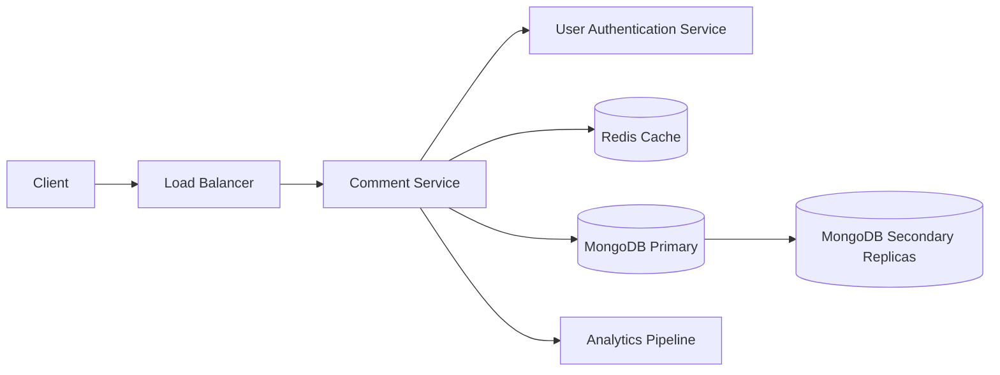
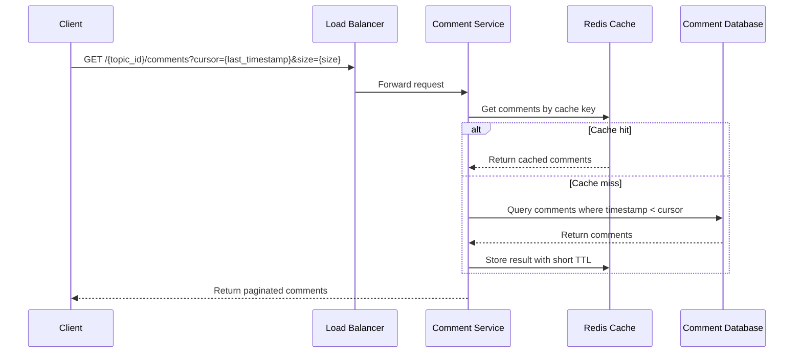
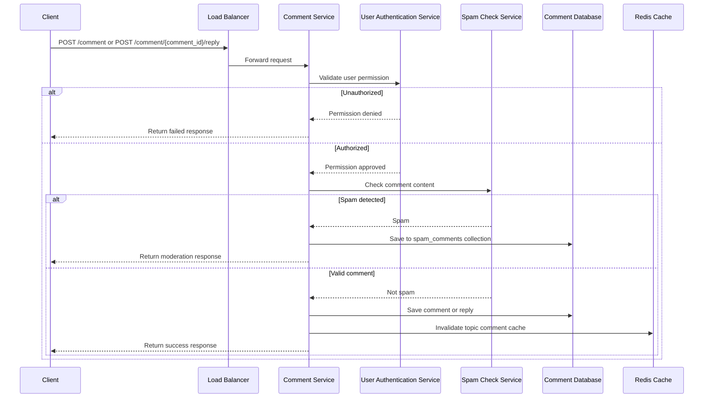
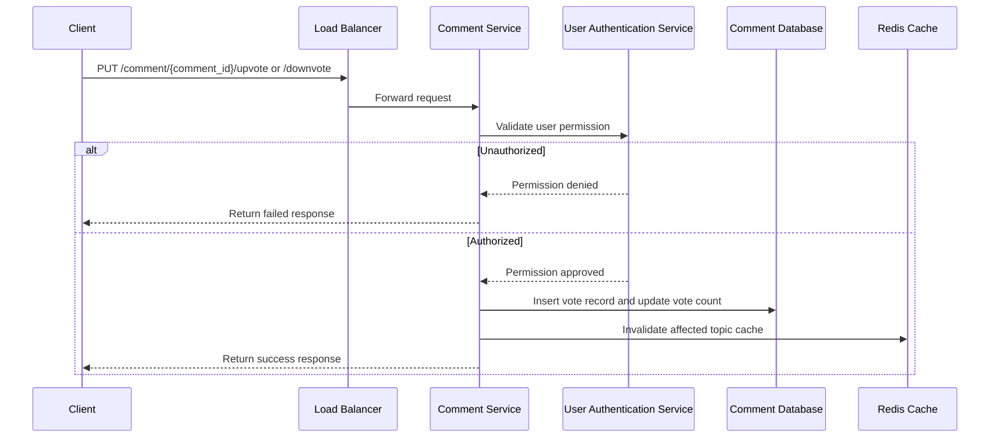
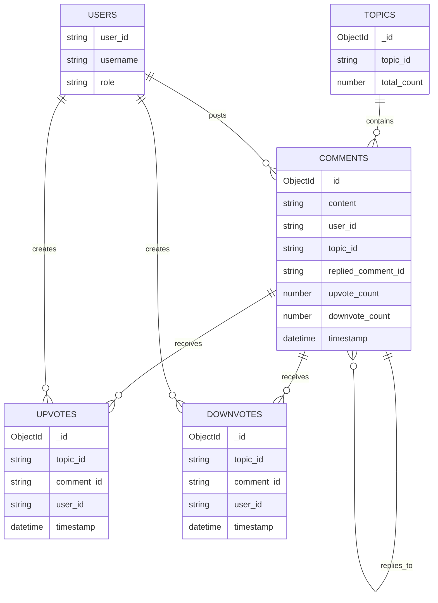
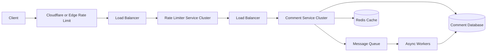
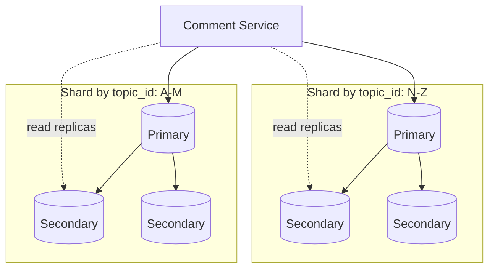

# Comment System Mermaid Diagrams

## High-Level Architecture

## Read Comments Flow

## Write Comment Flow

## Voting Flow

## Data Model

## Peak Traffic Design

## Database Replication and Sharding

