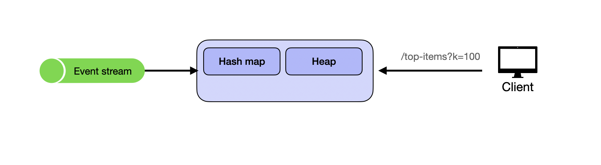
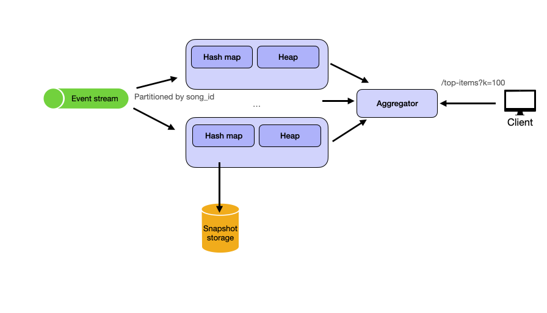
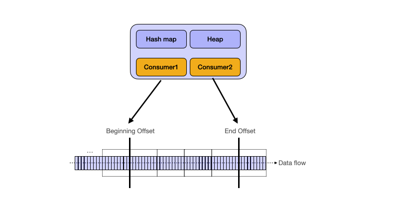

# Design

## API Endpoints

### Get Top Items

```http
GET /top-items?k=100&time_window=1d
```

Return the top K most played songs in the last time window (1 day in this case). The time window is optional and defaults to all time if not specified. The response is a list of items with their IDs and play counts.

### Request And Response Details

#### Response Body

```ts
{
  items: [
    { id: string, count: number }
  ]
}
```

## High Level Design

## 1. Global Window Top K, Low QPS

The system should allow users to view the top k most played songs of all time. The traffic is limited so that a single instance can handle it.

### Data Structure

If you are relatively familiar with algorithms and data structures, the "Top K" in the question should scream Heap to you. Indeed, a heap is the most efficient way to find the top K elements, in particular, a min heap.

Here's a quick recap of how a min heap works: We can use a min heap to keep track of the top K elements. As new elements come in through the stream, we compare the current element with the root of the heap. If the current element is greater than the root, we replace the root with the current element and adjust the heap.

The head of the heap will always hold the least viewed video among the Top-K. Alongside the heap, we maintain a hash map to store the view counts and track the heap index for each video, ensuring efficient updates.



Here's how the data structure looks like:

- Heap: Stores `(VideoID, ViewCount)` tuples, where the smallest element is at the root.
- Heap example: `[(video1, 5), (video2, 3), (video3, 8)]`
- Hash map: Stores `(VideoID, HeapIndex)` pairs.
- Hash map example: `{ video1: (index: 0, count: 5), video2: (index: 1, count: 3), video3: (index: 2, count: 8) }`

### Why Store Heap Index In Hash Map?

When a new event arrives (e.g., event(videoId_X, viewCountsTotal_Y)), if the video already exists in the heap:

- We need to update its count.
- After updating the count, the element may no longer maintain the heap property, so we need to reheapify (bubble up or bubble down).

Without knowing the element’s current position in the heap, we would need to search the entire heap to locate it. This would take O(K) time (where K is the size of the heap), which is inefficient. By storing the heap index in the hash map, we can directly access the element’s position in O(1) time. This allows us to quickly modify the element’s count and perform the reheapify operation (in O(log K) time). For songs that are not in the top K heap, we can simply not store any index in the hash map to save space since the number of songs is much larger than K.

### Algorithm To Maintain Top-K Videos

When a new event arrives, we first update the view count in the hash map. Then we check if the video is already in the heap.

#### Processing Logic

- If `ViewCount` is smaller than the head of the heap, discard the event since it won't affect the Top-K.
- Otherwise, check if `VideoID` exists in the hash map.
- If the video is already in the heap, update the count in the hash map.
- Re-heapify by performing a bubble-down operation, where the element swaps with its children until the heap property is restored.
- If the video is not in the heap, replace the head of the heap with the new video.
- Perform a sift-down operation to maintain the heap property.

Now this is pretty standard stuff with a min heap. At this point, it's really a DSA question. Our design needs to address the following issues:

- Scalability: The service operates as a single instance and keeps the min-heap in memory. It won't be able to handle 120k views/second, so we need a way to scale the service.
- Fault Tolerance: If the service crashes or is redeployed, the in-memory min-heap will be lost. We need a mechanism to persist the heap for recovery, avoiding the need to replay all events, which would be too slow.
- Query Flexibility: The service only supports queries for all-time top-K videos. It needs to be extended to support querying top-K for specific time windows (e.g., 1 hour, 1 day, or 1 month).

## 2. Global Window Top K, High QPS

The system should allow users to view the top k most played songs of all time. The traffic is high so that we need to scale out the system.

Let's address the first two issues in this section.

### To Increase Throughput

The obvious solution to increase throughput is to partition the service to multiple instances. One design decision is how to map the event stream to the backend instances.

### Partitioning Schemes

- Round-Robin
- Fixed Hash
- Dynamic Hash

#### Round-Robin

Suitable with caveats.

Round-robin partitioning distributes events evenly across partitions.

How it works:

- Events are distributed evenly across partitions in a round-robin fashion to backend instances.

Pros:

- Provides even load distribution.
- Simple to implement without coordination.

Cons:

- Can lead to inconsistencies, as events for the same song may be processed by different instances. We need to keep more than top K songs in each partition because a song may not be in the top K in one partition but is in the top K in overall count when aggregated across all partitions.

Conclusion:

- Suitable with caveats.

#### Fixed Hash

Suitable.

Partition the event stream by `song_id`.

How it works:

- Events are routed based on a hash of the song ID.
- Each instance processes events for specific hash partitions.
- `Partition = hash(song_id) % num_partitions`.

Pros:

- Ensures consistency: all events for a song go to the same partition, so we don't need to record more than top K songs in each partition.
- Easy to implement and scales well with more partitions.
- Good load distribution if song requests are uniformly spread.

Cons:

- Hotspots can occur if some songs become exceptionally popular (e.g., a new hit song).
- Rebalancing is complex. If the number of partitions changes (e.g., scaling up/down), many songs may need to move to different partitions.

Conclusion:

- Suitable.

#### Dynamic Hash

Suitable.

Consistent Hashing is used to dynamically adjust the number of partitions.

How it works:

- Hash the song IDs: Each song ID (or event identifier) is hashed to a position on a circular hash ring.
- Hash the backend instances: Each backend instance is also assigned a position on the same hash ring.
- Event-to-instance mapping: Events (song IDs) are routed to the nearest instance clockwise on the hash ring. This means each instance is responsible for the range of events between itself and the previous instance on the ring.
- Handling instance changes: When a backend instance is added or removed, only the range of events between the removed instance and its next neighbor is affected. For an added instance, only the events that map between the new instance and its preceding neighbor are reassigned to the new instance.

Pros:

- Minimal rebalancing. When an instance is added or removed, only a small fraction of the keys (song IDs) are remapped, reducing the need for rebalancing across all instances. This ensures minimal disruption and low data movement.
- Fault tolerance. In case of instance failure, only a portion of the data is affected, making recovery faster and ensuring other instances can continue processing unaffected.

Cons:

- Increased complexity. Implementing consistent hashing requires a more sophisticated setup compared to simple hashing or range-based partitioning.

Conclusion:

- Suitable, however, the complexity of implementing consistent hashing is higher.

To keep things simple, we'll use the fixed hash partitioning scheme.

- Partition the event stream by `song_id`: Each backend instance processes events for a specific partition based on the song ID. This ensures that all events for a given song are routed to the same instance, avoiding inconsistencies when updating the heap.
- Aggregate the top-K from each instance: After each instance processes events and maintains its local top-K heap, a coordinator service aggregates the top-K results from all instances to produce the final overall top-K.

### To Increase Reliability

If an instance fails or crashes, its in-memory data structures (heap and hash map) are lost, so we need a mechanism for data recovery. We can persist the heap and stream offset as a snapshot to a remote datastore (e.g., Redis, DynamoDB, or cloud storage). This ensures that data can be recovered in case of a failure.

Each snapshot includes:

- Heap Data: The current state of the min-heap.
- Stream Offset: The position in the event stream from which events have already been processed.

On server crash, we can reconstruct the heap from the latest snapshot. It will then replay events from the stored stream offset to catch up with any missed events and restore the correct state.

If no snapshot is available for a given backend, the server falls back to replay events from the beginning of the stream to ensure consistency after a crash or restart.



## 3. Sliding Window Top K, High QPS

The system should allow users to view the top k most played songs in the last X time in a sliding window.

Now let's tackle the sliding window version of the problem. A sliding window is tricky because it requires us to maintain a dynamic set of data. Adding data is easy, but how do we remove data that is no longer in the window?

Again if you are relatively familiar with algorithms and data structures, sliding window problems can be commonly solved using the Two Pointers Technique. We can borrow the idea of two pointers in our design.

In stream processing systems like Kafka, RabbitMQ, or Pulsar, an offset is a unique identifier that represents a position within a partition of a stream. It allows stream processors to track which messages have been processed and where to resume if interrupted. We can use two separate consumers per instance each maintaining a different offset to implement the sliding window.



- Beginning Offset: Marks the start of the time window.
- End Offset: Marks the most recent event processed.

We can calculate the top K songs in the current window by taking the difference between the end offset and beginning offset.

### Advancing Offsets

As new events arrive, we maintain two offsets within each time window:

#### End Offset For New Events

- Tracks the most recent event processed.
- Ensures all new view events entering the time window are applied to the heap.
- Example: Current timestamp (`now`).

#### Beginning Offset For Expiring Events

- Tracks the oldest event that is still relevant in the sliding window.
- Slides forward to remove expired events from the heap.
- Example: `now - window_size` (e.g., `now - 1h` for a 1-hour window).

### Processing Events

For each time window update:

For the end offset (recent events):

- Process new events using the same heap logic as before.
- Add new song plays to the counts.

For the beginning offset (expired events):

- Do the reverse operation to remove expired events from the heap.
- Ensure `timestamp(beginning + offset) <= now - window_size`.
- This efficiently removes stale events from the window.

### Bucket-Based Sliding Window Implementation

The two-offset approach works at the event level: the end offset processes new events, and the beginning offset processes expired events. A more practical production implementation is to aggregate events into time buckets first, then update the sliding window by adding the newest bucket and removing the expired bucket.

For example, if the window is 1 hour and the bucket size is 1 minute, each worker maintains 60 buckets:

```text
time_buckets = array[60] of HashMap<song_id, count_in_bucket>
```

Each bucket stores per-song counts for that minute, not just the total number of plays:

```text
bucket_10_00:
  songA: 5
  songB: 2

bucket_10_01:
  songA: 3
  songC: 4
```

Each worker also maintains two additional data structures:

```text
song_counts: HashMap<song_id, current_window_count>
count_to_songs: TreeMap<count, Set<song_id>>
```

`song_counts` stores the total count for each song inside the current sliding window. `count_to_songs` stores the same information in ranked order, so the worker can get local top K by iterating the `TreeMap` from the largest count to the smallest count.

When a new event arrives:

```text
current_bucket[song_id] += 1

old_count = song_counts[song_id]
new_count = old_count + 1

remove song_id from count_to_songs[old_count]
add song_id to count_to_songs[new_count]
song_counts[song_id] = new_count
```

When the window slides forward and an old bucket expires, the worker subtracts the aggregate counts from that bucket:

```text
for song_id, expired_count in expired_bucket:
    old_count = song_counts[song_id]
    new_count = old_count - expired_count

    remove song_id from count_to_songs[old_count]

    if new_count > 0:
        add song_id to count_to_songs[new_count]
        song_counts[song_id] = new_count
    else:
        remove song_id from song_counts

clear expired_bucket
reuse it for the new time bucket
```

To get local top K, the worker scans `count_to_songs` in descending count order and stops after K songs:

```text
result = []

for count in count_to_songs.descending_keys():
    for song_id in count_to_songs[count]:
        result.append({ song_id, count })

        if len(result) == K:
            return result
```

This approach avoids sorting all active songs on every query. Each update only touches songs that appear in the new event or in the expired bucket. The cost is `O(log N)` per updated song because the worker needs to update the `TreeMap`, where `N` is the number of active songs in that worker's window.

After each worker computes its local top K, a coordinator merges the local results from all workers to produce the global top K. The coordinator only needs to sort or heap-merge `num_workers * K` items, which is much smaller than sorting all active songs in the system.

## Deep Dive Questions

### What If We Only Need Approximate Results?

Aha, this is where we should have started. Does Spotify really needs absolutely accurate count of the top K most popular songs?

If exact results are not required, the system can be significantly simplified and optimized to reduce latency, resource consumption, and complexity. In cases where a margin of error is acceptable, we can explore approximation techniques that offer near-real-time insights with fewer computational and storage overheads.

One option is to use Count-Min Sketch. A Count-Min Sketch is a space-efficient, probabilistic data structure used to track frequencies of elements (e.g., song play counts) with approximate accuracy.

Advantages:

- Constant time updates: O(1) for both inserts and queries.
- Lower memory usage compared to traditional hash maps and heaps.
- Handles high-throughput events efficiently.

Trade-offs:

- There’s a small probability of error in the reported counts. It only gives upper-bound estimates of counts (e.g., a song might have 1,000 or slightly fewer plays, but not more).
