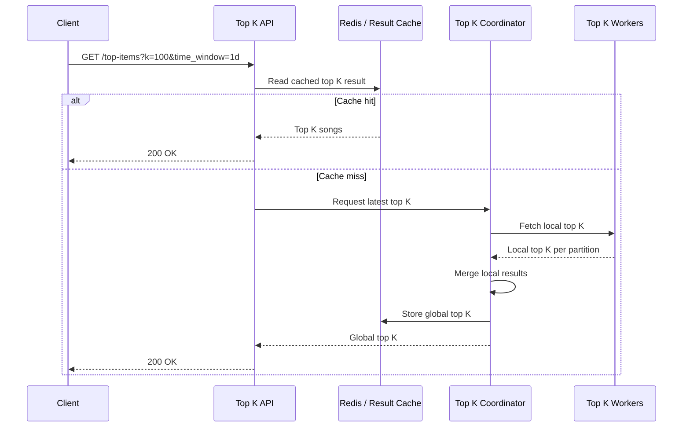
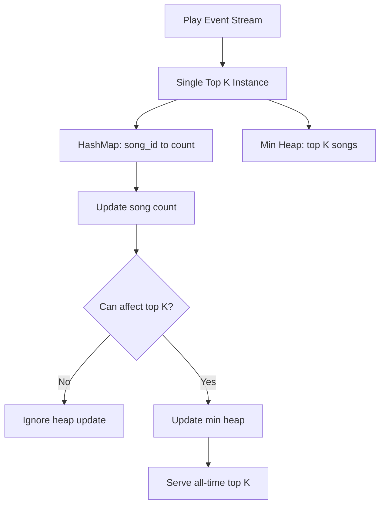
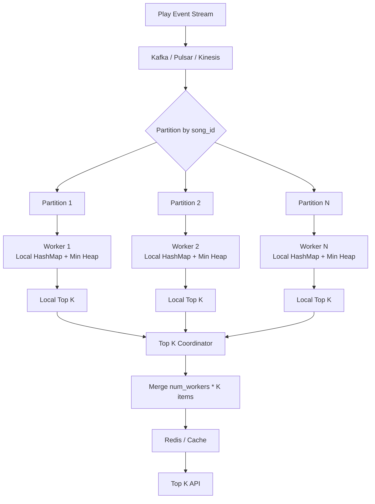
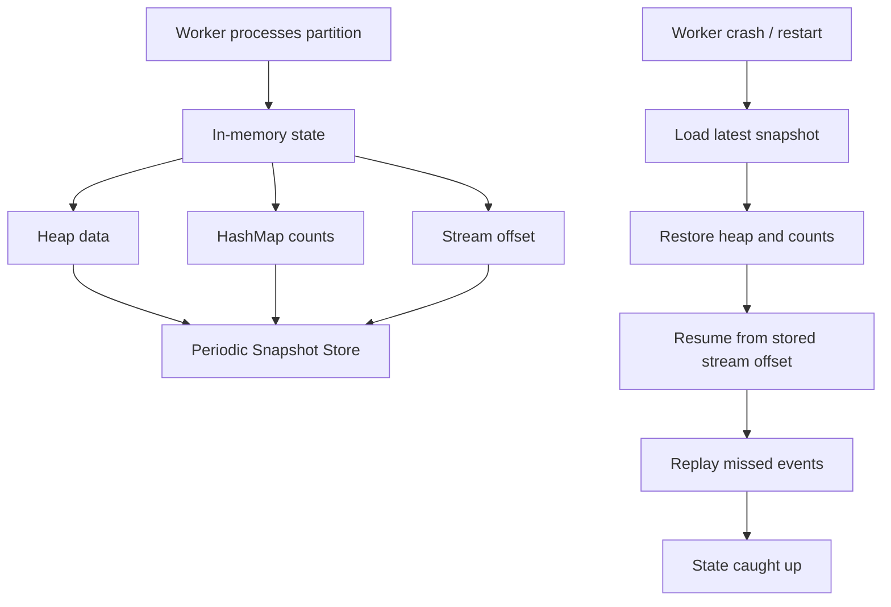
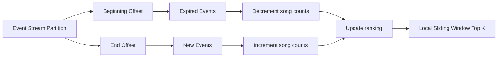
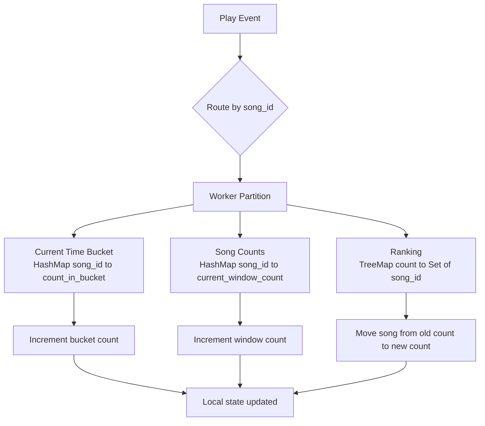
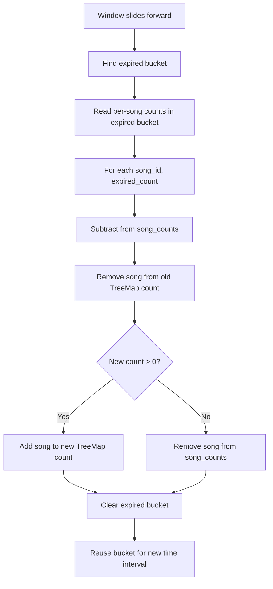
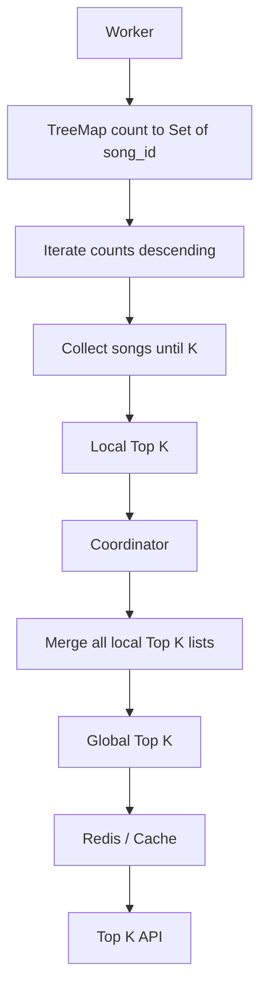

# Mermaid Diagrams

## API Flow

## Global Window Top K, Low QPS

## Global Window Top K, High QPS

## Snapshot Recovery

## Sliding Window With Two Offsets

## Bucket-Based Sliding Window

## Bucket Expiration

## Sliding Window Top K Read Path

